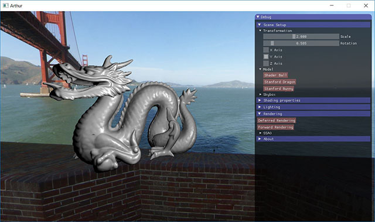
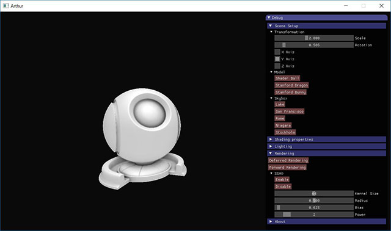
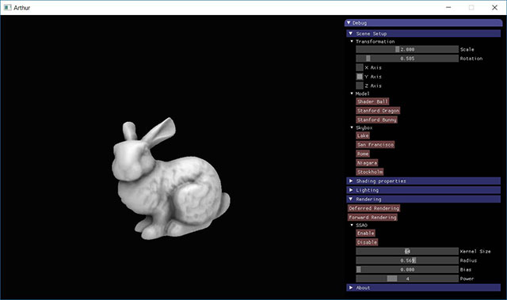
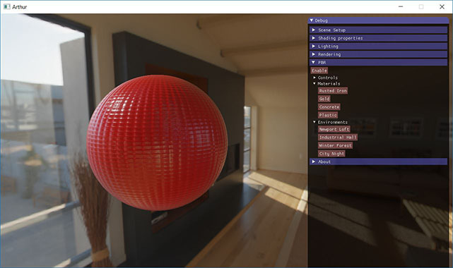
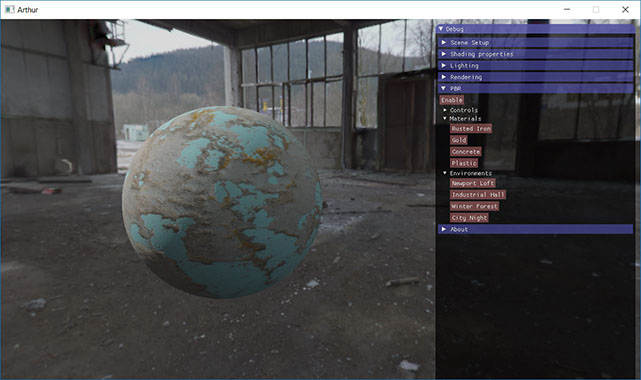
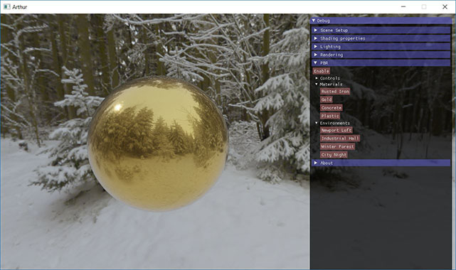
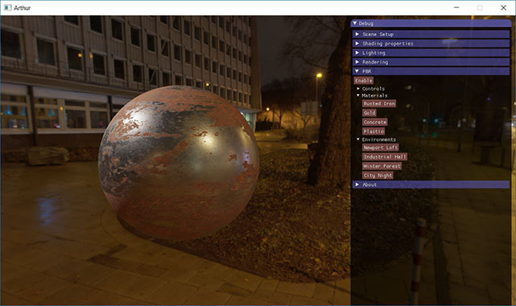

# Arthur
Real time rendering using C++, OpenGL, GLSL, ImGui.\
Object loading done using ASSIMP library.\
Image handling done using SOIL library.

#### Features:
* Forward, deferred, and physically based rendering pipelines
* Point and directional lights
* Basic material representation
* Screen space ambient occlusion
* IBL using HDR textures
* Physically based rendering using PBR textures

## Screenshots

 Forward rendering with multiple model loading and skyboxes. Makes use of Assimp library to load models as OBJs. Includes shader ball, dragon, bunny objs. SOIL used to load images.

 

Deferred rendering for Screen Space Ambient Occlusion (SSAO)

Physically based rendering using albedo, normal, metallic, roughness, ambient occlusion, and environment maps 

